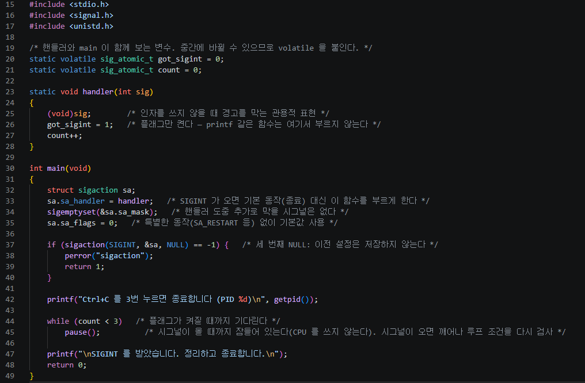
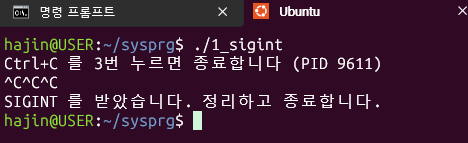
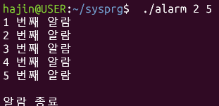
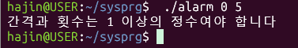
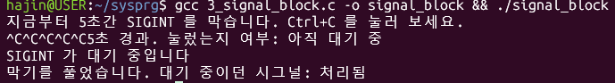

# 시스템 프로그래밍 시그널 실습

## 1. 프로젝트 설명
WSL(Ubuntu) 환경에서 C 언어로 리눅스 시그널을 다뤄 보는 실습이다.

- `1_sigint.c` : SIGINT(Ctrl+C)를 3번 받으면 종료하는 프로그램
- `2_alarm.c` : SIGALRM과 `alarm()`으로 지정한 간격마다 알람을 출력하고, 지정한 횟수만큼 반복하는 타이머
- `3_signal_block.c` : `sigprocmask`로 SIGINT를 막은 구간에서 Ctrl+C를 누르고, 막기를 풀 때 시그널이 전달되는지 확인하는 프로그램
<!-- - (도전 과제) `4_sigchld.c` : SIGCHLD로 자식 3개를 자동 수거 -->

## 2. 프로그램별 결과

### 2-1. 1_sigint.c
Ctrl+C를 누를 때마다 핸들러가 횟수를 세고, 3번째에 프로그램이 종료된다.

### 2-2. 2_alarm.c : 타이머 만들기
`./alarm <간격초> <반복횟수>` 형태로 실행하면 입력한 간격(초)마다 알람을 출력하고, 지정한 횟수만큼 반복한 뒤 종료한다. (예: `./alarm 2 5` → 2초 간격으로 5번 출력)

- `alarm()`은 한 번만 울리므로, 알람이 울린 뒤 `main`에서 `alarm(interval)`을 다시 걸어 반복하게 했다.
- `sigaction`으로 SIGALRM 핸들러를 등록하고, 핸들러에서는 `timeout = 1`, `count++`만 수행한다.
- `main`은 `pause()`로 대기하다가 알람 신호가 오면 깨어나 출력한다.
- 인자 개수(`argc`)와 값(`interval`, `total`이 1 이상인지)을 검사한다.

정상 실행 (`./alarm 2 5`)

잘못된 입력 (`./alarm 0 5`, `./alarm abc 3`, `./alarm`)

### 2-3. 3_signal_block.c : 시그널 막아 보기
`sigprocmask(SIG_BLOCK)`으로 SIGINT를 막고 5초 동안 대기한 뒤, `SIG_SETMASK`로 원래 마스크를 복원하는 프로그램이다. 막힌 5초 동안 Ctrl+C를 누르고, 막기를 풀 때 시그널이 전달되는지 확인했다.

- 막힌 동안 Ctrl+C를 눌러도 프로그램은 종료되지 않았고, 시그널은 버려지지 않고 대기 상태가 되었다.
- 마스크를 복원하는 순간 대기 중이던 SIGINT가 전달되어 핸들러가 실행되었다.
- 5초 경과 시점의 출력은 아직 핸들러가 실행되기 전이라 Ctrl+C를 눌렀든 안 눌렀든 `아직 대기 중`으로 나오고, 마지막 줄(`처리됨` / `없었음`)에서 차이가 드러났다.
- Ctrl+C를 여러 번 눌러도 대기 중인 SIGINT는 한 번으로 합쳐져 핸들러가 한 번만 실행되었다.

<!--
### 2-4. (도전 과제) 4_sigchld.c
(설명과 실행 화면 추가)
-->

## 3. AI 사용 내용
- 사용한 AI: Claude
- 도움받은 부분: WSL 환경 설정, 컴파일과 실행 방법, `volatile`, `argc/argv`, `atoi`, `alarm`/`pause`, `sigprocmask` 등의 개념 설명과 단계별 힌트
- 코드는 힌트를 바탕으로 직접 작성했고, 작성한 코드를 AI에게 보여주며 문제점을 확인했다.

## 4. 본인의 보강 내용
- `volatile sig_atomic_t`를 쓰는 이유(핸들러와 `main`이 공유하는 변수를 매번 메모리에서 읽기 위함)를 공부해서 적용했다.
- **알람 대기 구조 수정**: 처음에는 `alarm()` 직후 반복문이 기다리지 않고 바로 돌아서 출력이 한꺼번에 나왔다. `while (!timeout) pause();`로 알람이 올 때까지 기다리게 고쳤다.
- **`timeout` 초기화**: 매 반복마다 `timeout = 0`으로 되돌리지 않으면 두 번째부터 기다리지 않는다는 것을 확인하고 반복 시작 부분에 추가했다.
- **값 검사 위치**: 값 검사를 `atoi` 변환 전에 두면 전역 변수 초기값(0) 때문에 항상 오류가 난다는 것을 알고, 변환 뒤로 옮겼다.
- **`alarm(0)` 문제 확인**: 검사가 없을 때 `./alarm 0 5`를 실행하면 `pause()`에서 영원히 멈추는 것을 직접 확인했고, 1 이상의 정수만 받도록 검사를 넣었다.
- **시그널 마스크 확인**: 막힌 시그널이 버려지지 않고 대기했다가 마스크를 복원할 때 전달된다는 것을, Ctrl+C를 누르는 횟수를 바꿔 가며 직접 실행해 확인했다.
